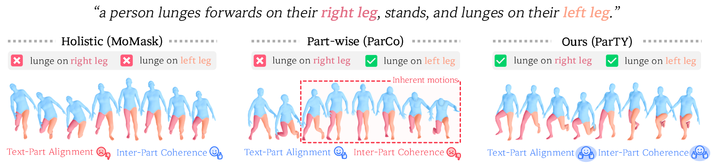

# ParTY: Part-Guidance for Expressive Text-to-Motion Synthesis (CVPR 2026)

<p align="left">
  <a href="https://arxiv.org/abs/2603.09611">
    
  </a>
  <a href="https://visualsciencelab-khu.github.io/ParTY_project/">
    
  </a>
</p>

<p align="center">
  
</p>


## Initial Settings

### CUDA

Our model was trained and tested on a single A5000 GPU, using the following software environment: `Python 3.7.11`, `PyTorch 1.10.1`, `CUDA 11.3.1`, `cuDNN 8.2.0`, and `Ubuntu 20.04`.

### Conda

```
conda create -n ParTY blas=1.0 bzip2=1.0.8 ca-certificates=2021.7.5 certifi=2021.5.30 freetype=2.10.4 gmp=6.2.1 gnutls=3.6.15 intel-openmp=2021.3.0 jpeg=9b lame=3.100 lcms2=2.12 ld_impl_linux-64=2.35.1 libffi=3.3 libgcc-ng=9.3.0 libgomp=9.3.0 libiconv=1.15 libidn2=2.3.2 libpng=1.6.37 libstdcxx-ng=9.3.0 libtasn1=4.16.0 libtiff=4.2.0 libunistring=0.9.10 libuv=1.40.0 libwebp-base=1.2.0 lz4-c=1.9.3 mkl=2021.3.0 mkl-service=2.4.0 mkl_fft=1.3.0 mkl_random=1.2.2 ncurses=6.2 nettle=3.7.3 ninja=1.10.2 numpy=1.20.3 numpy-base=1.20.3 olefile=0.46 openh264=2.1.0 openjpeg=2.3.0 openssl=1.1.1k pillow=8.3.1 pip=21.0.1 readline=8.1 setuptools=52.0.0 six=1.16.0 sqlite=3.36.0 tk=8.6.10 typing_extensions=3.10.0.0 wheel=0.37.0 xz=5.2.5 zlib=1.2.11 zstd=1.4.9 python=3.7
```
```
conda activate ParTY
```
```
conda install ffmpeg=4.3 -c pytorch
conda install pytorch==1.10.1 torchvision==0.11.2 torchaudio==0.10.1 cudatoolkit=11.3 -c pytorch -c conda-forge
```
```
pip install -r requirements.txt
```

### Feature Extractors

```
bash dataset/extractors/download_glove.sh
bash dataset/extractors/download_extractor.sh
```

### Datasets

We used the [HumanML3D](https://github.com/EricGuo5513/HumanML3D) and [KIT-ML](https://arxiv.org/pdf/1607.03827.pdf) 3D human motion-language datasets, both of which can be directly downloaded from [Google Drive](https://drive.google.com/drive/folders/1BuxQWAWtxwauD7AqF0TIpWjoqujYKq8v?usp=share_link) as preprocessed by [ParCo](https://github.com/qrzou/ParCo).


<!-- ## Training

### Temporal-aware VQ-VAE

### Part-Guided Network


## Evaluation

### Temporal-aware VQ-VAE

### Part-Guided Network


## Visualization -->


## Citation

If you find our work helpful, please consider citing:
```
@InProceedings{Heo_2026_CVPR,
    author    = {Heo, KunHo and Kim, SuYeon and Gwon, Yonghyun and Kim, Youngbin and Cho, MyeongAh},
    title     = {ParTY: Part-Guidance for Expressive Text-to-Motion Synthesis},
    booktitle = {Proceedings of the IEEE/CVF Conference on Computer Vision and Pattern Recognition (CVPR)},
    month     = {June},
    year      = {2026},
    pages     = {23549-23558}
}
```


## Acknowledgement

We thank for:
[T2M-GPT](https://github.com/Mael-zys/T2M-GPT), 
[MoMask](https://github.com/EricGuo5513/momask-codes),
[ParCo](https://github.com/qrzou/ParCo), 
etc.